<!--- 
activate p2
python -m readme2tex --nocdn --output papers_v2.md --readme papers.md
-->
# Конспекты статей

1. [T Nguyen, R Novak, L Xiao, J Lee (2021) Dataset Distillation with Infinitely Wide Convolutional Networks](#1)

## <a name="1"/> T Nguyen, R Novak, L Xiao, J Lee (2021) [Dataset Distillation with Infinitely Wide Convolutional Networks](https://arxiv.org/abs/2107.13034)
### KIP method  

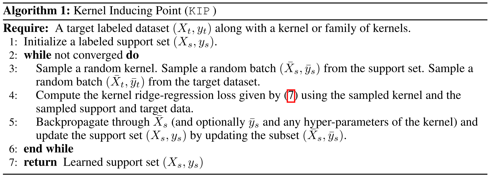
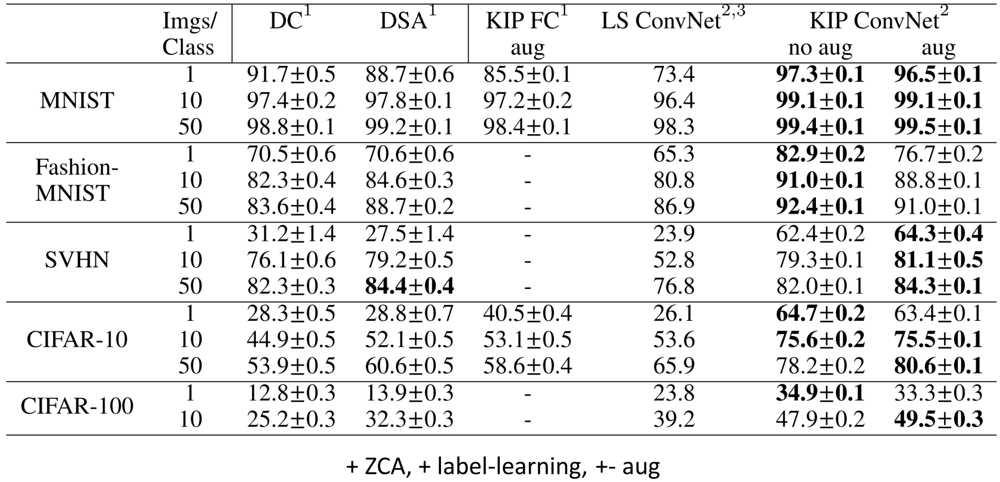

### Paper highlights  
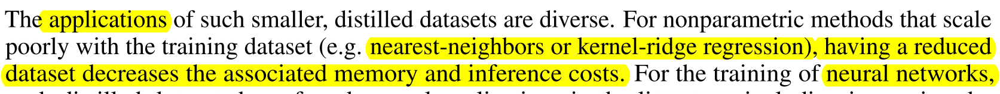
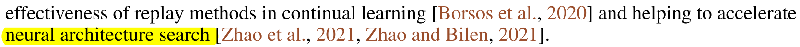
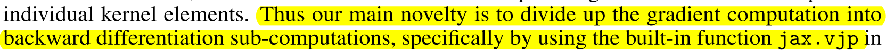
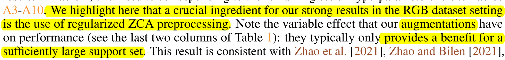
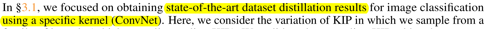
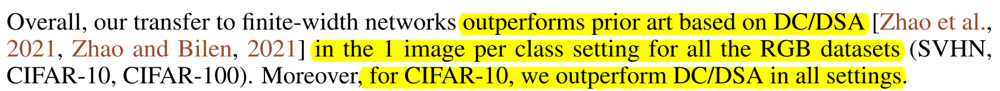
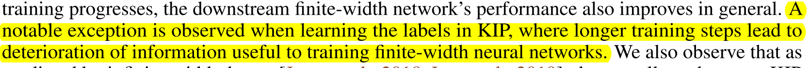
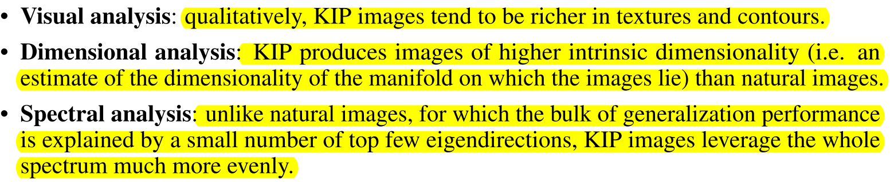
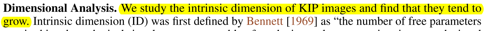
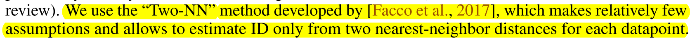
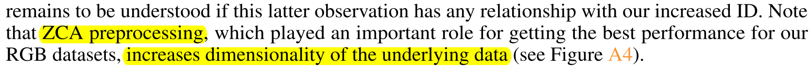
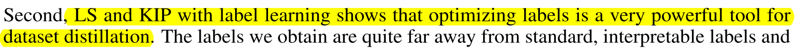
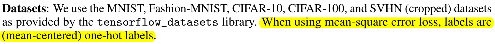
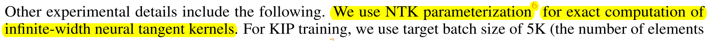
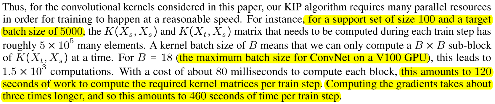  
