<!--- 
activate p2
python -m readme2tex --nocdn --output papers_v2.md --readme papers.md
-->
# Конспекты статей

1. [T Nguyen, R Novak, L Xiao, J Lee (2021) Dataset Distillation with Infinitely Wide Convolutional Networks](#1)
2. [G Katz, ECR Shin, D Song (2016) Explorekit: Automatic feature generation and selection](#2)
3. [Kaul A, Maheshwary S, Pudi V (2017) Autolearn — Automated feature generation and selection](#3)
4. [Luo Y, Wang M (2019) Autocross: Automatic feature crossing for tabular data in real-world applications](#4)
5. [Liu Q (2018) DNN2LR: Automatic Feature Crossing for Credit Scoring](#5)
6. [Xie Y, Wang Z, Li Y (2021) Fives: Feature interaction via edge search for large-scale tabular data](#6)

## <a name="1"/> T Nguyen, R Novak, L Xiao, J Lee (2021) [Dataset Distillation with Infinitely Wide Convolutional Networks](https://arxiv.org/abs/2107.13034)
### KIP method  

### Paper highlights  

  

## <a name="2"/> G Katz, ECR Shin, D Song (2016) [Explorekit: Automatic feature generation and selection](http://people.eecs.berkeley.edu/~dawnsong/papers/icdm-2016.pdf)
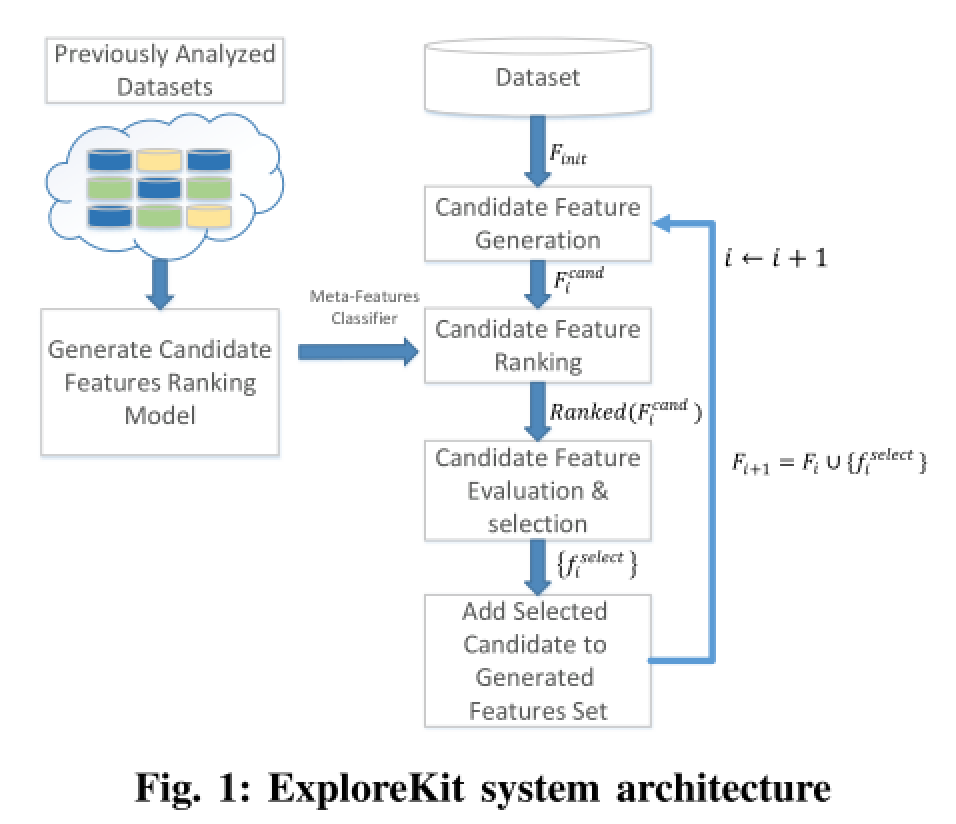
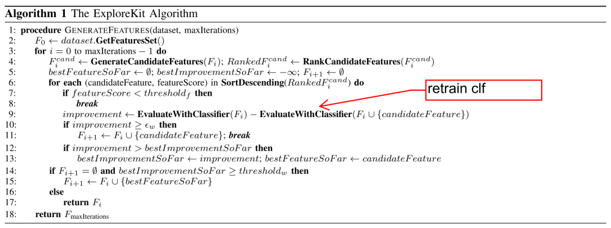
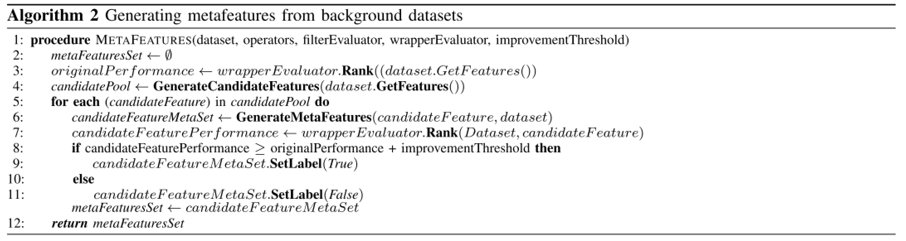  

### Feature generation operators  
Unary operators:
* Discretizers: used to convert continuous and datetime features into discrete (i.e. categorical) ones
* Normalizers: used to fit the scale of continuous (i.e. numeric) features to specific distributions

Binary operators:
* +, −, ×, ÷

Higher-order operators:
* GroupByThenMax, GroupByThenMin
* GroupByThenAvg, GroupByThenStdev
* GroupByThenCount

Generating the Candidate Features Set:
1. Apply the unary operators on on all non-discrete
2. Apply binary and higher-order operators
3. For every non-discrete feature again apply all the unary operators
4. Union all generated features  

Meta-Features consist of:  
* **Dataset-based meta-features**:  
  - *General information*: number of instances and classes, statistics on the dataset size and other statistics  
  - *Initial evaluation*: statistics on the current performance of the classifier when applied on current set of features  
  - *Entropy-based measures*: partition current set of features in type-based groups and calculate Information Gain  
  - *Feature diversity*: partition current set of features in type-based groups and use the chi-squared and paired-t test to calculate the similarity of each pair in a group  
* **Candidate feature-based meta-features for feature F**  
  - calculate statistics on correlation of F to each of the type-based groups
  - statistics on parent features
  - statistics on the inter-correlation of the parent features of F, as well as their correlation with the remaining features
    
### Training the ranking classifier
* Set threshold in percentages of improvement of AUC-ROC to make feature good one to include
* Clf trained with loo strategy

### Comments
* In the heart of selection algorithm authors use score function. We need to make sure that model is calibrated.
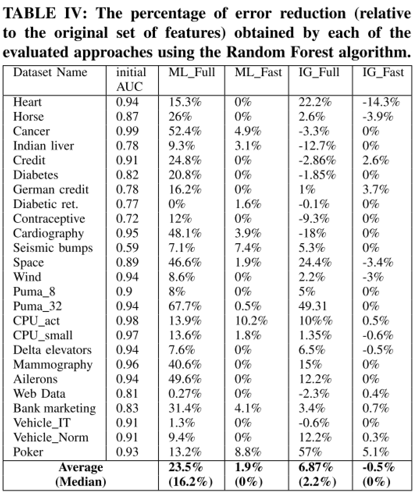  

## <a name="3"/> Kaul A, Maheshwary S, Pudi V (2017) [Autolearn — Automated feature generation and selection](https://github.com/saket-maheshwary/AutoLearn)
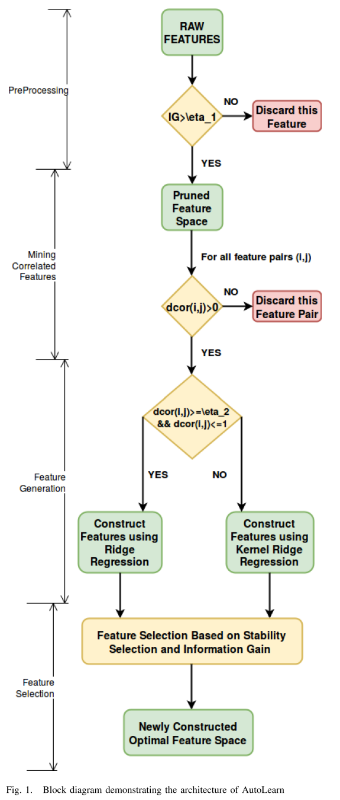  

**IG** - mutual information between feature and target  
**dcor** - distance correlation:  
 - can capture all types of non-linear dependency  
 - it is applicable to random vectors of arbitrary and not necessarily equal dimension  
 - vary in [-1, 1]  

**Contruct features** - fit reg on i-feature and predict j-feature, add predicted feature and j-feature - pred_f  
**Stability selection** - fit RandomizedLasso and get features based on thresholding scores  

### Results
- Have 10x smaller set of generated features and +5% accuracy compared with TFC, FCTree, ExploreKit  

                                          

## <a name="4"/> Luo Y, Wang M (2019) [Autocross: Automatic feature crossing for tabular data in real-world applications](https://arxiv.org/abs/1904.12857) 
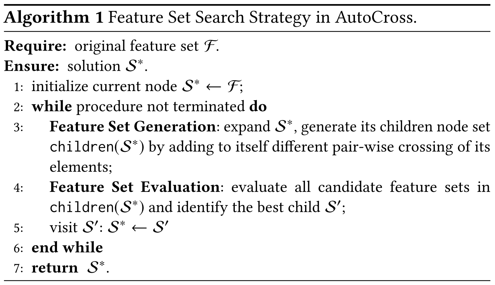  
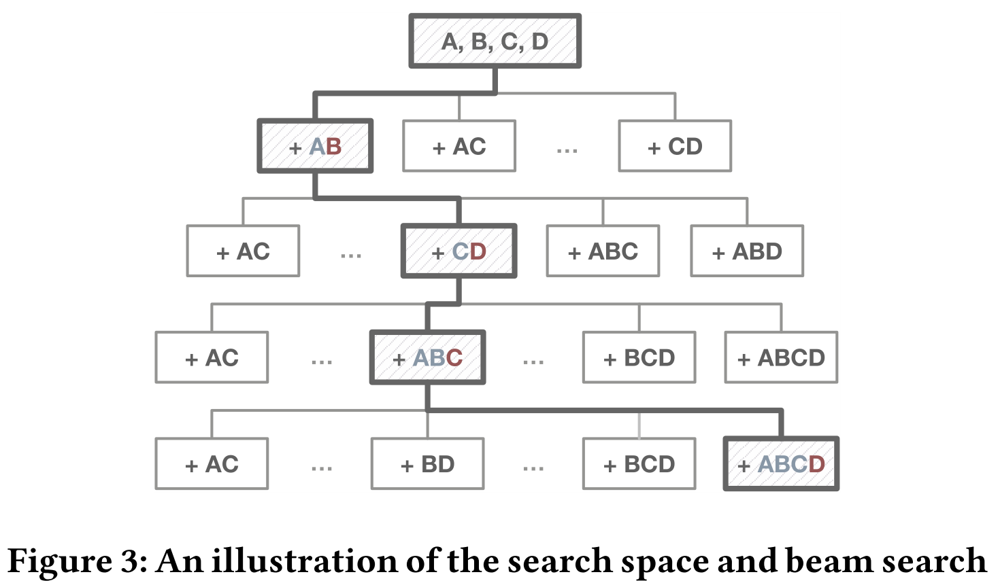  
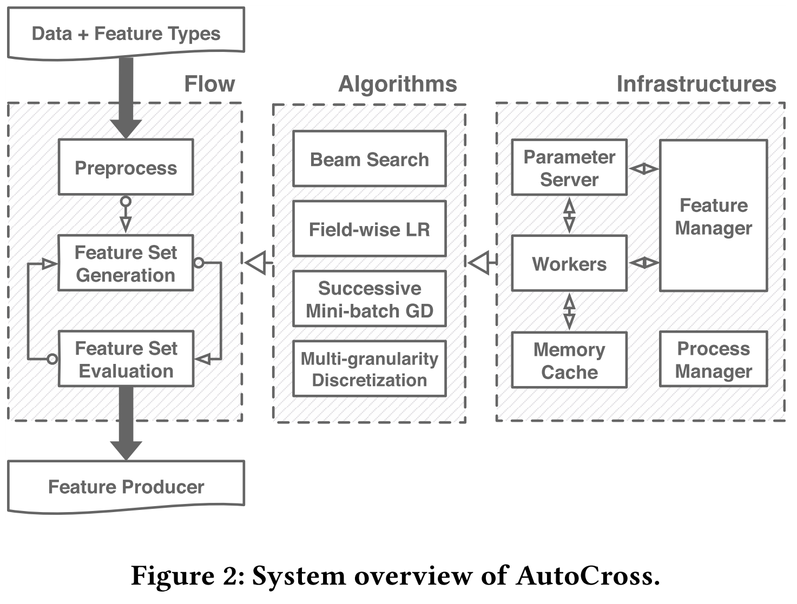  

                                          
  
**Feature Set Generation**:  
 - Discretize numeric features by multiple bins size. Select half of them based on logreg's quality. *(Multi-granularity Discretization)*
 - Make all pairs on current feature set F_cur and select one feature F_sel after Feature Set Evaluation. Add F_sel to F_cur. Let's denote a set of new cross-features as F_new. *(Beam Search)*

**Feature Set Evaluation**:  
 - Fit logreg on F_cur, refit with warm start logreg on F_new while fixing F_cur coeffs (*Field-wise LR*)

**Feature Selection** *(Successive Mini-batch GD)*:

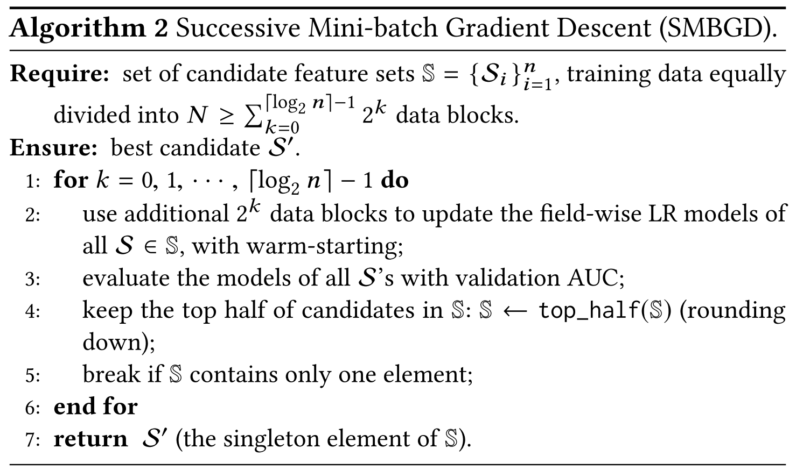

### Results
 - Online feature construction + [feature hashing](https://arxiv.org/pdf/0902.2206.pdf)
 - Most of new features are high-ordered
 - New features are useful for nn too  

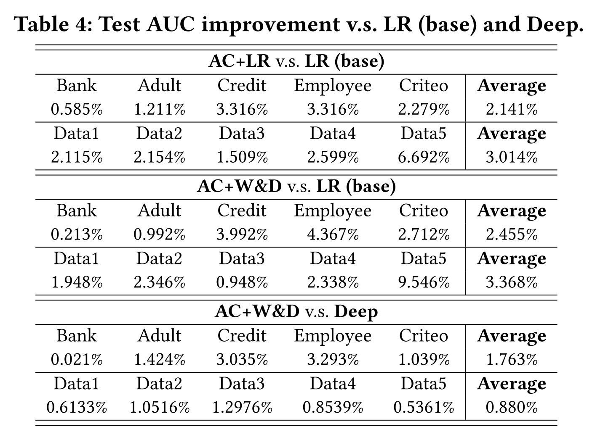

## <a name="5"/> Liu Q. (2018) [DNN2LR: Automatic Feature Crossing for Credit Scoring](https://arxiv.org/abs/2102.12036) 
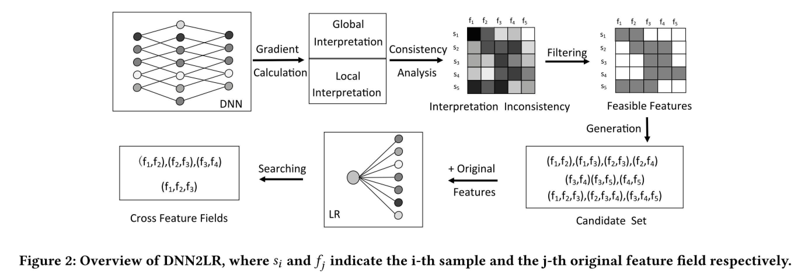

**Global and Local Interpretation**:  
*Local Interpretation of Feature* - градиенты по входному представлению признака @ (его значение).T (зависит от объекта)  
*Global Interpretation of Feature* - усредненные градиенты по входному представлению признака и объектам @ (его значение).T (не зависит от объекта)

**Interpretation Inconsistency** - L2-norm(Local Interpretation - Global Interpretation) (чем больше, тем больше признак находится в нелинейном отношении с другими признаками)  
**Filtering** - бинаризация по квантилю (>= 95% -> =1)  
**Generation** - выбор 3 * |F_orig| новых признаков на основе их встречаемости (новый признак - кортеж)  
**Searching**  

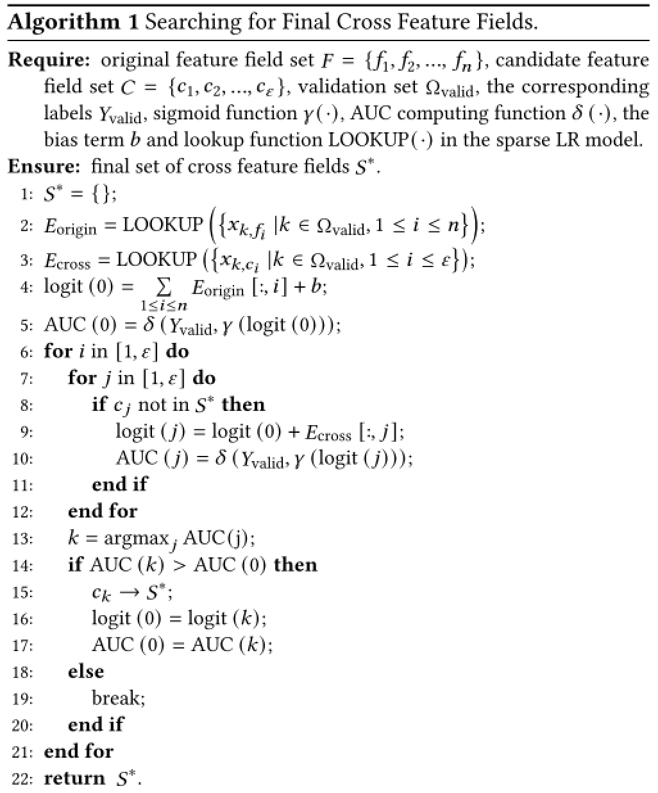  

### Results
 - На порядок быстрее AutoCross 
 - Можно находить нелинейные взаимосвязи в текстах тоже

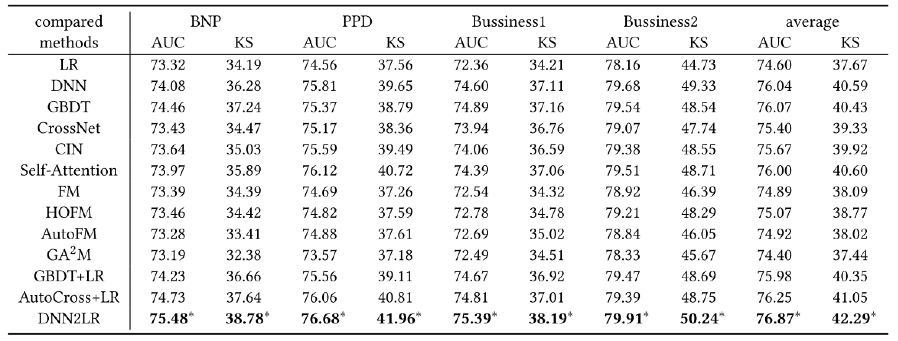  

## <a name="6"/> Xie Y, Wang Z, Li Y (2021) [Fives: Feature interaction via edge search for large-scale tabular data](https://arxiv.org/abs/2007.14573) 
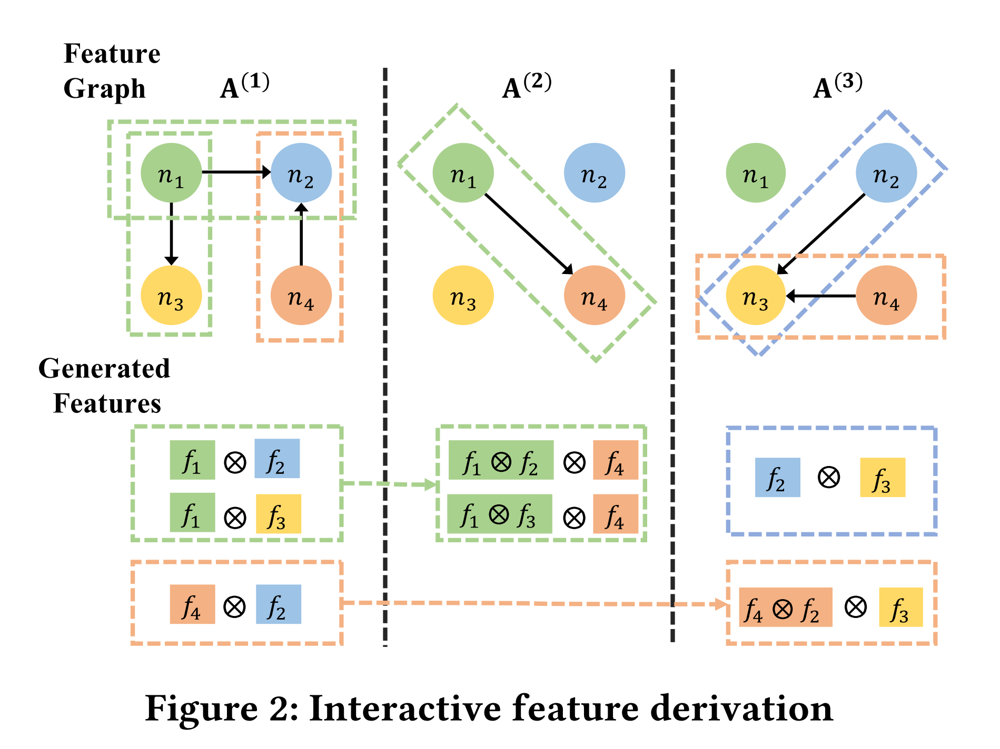
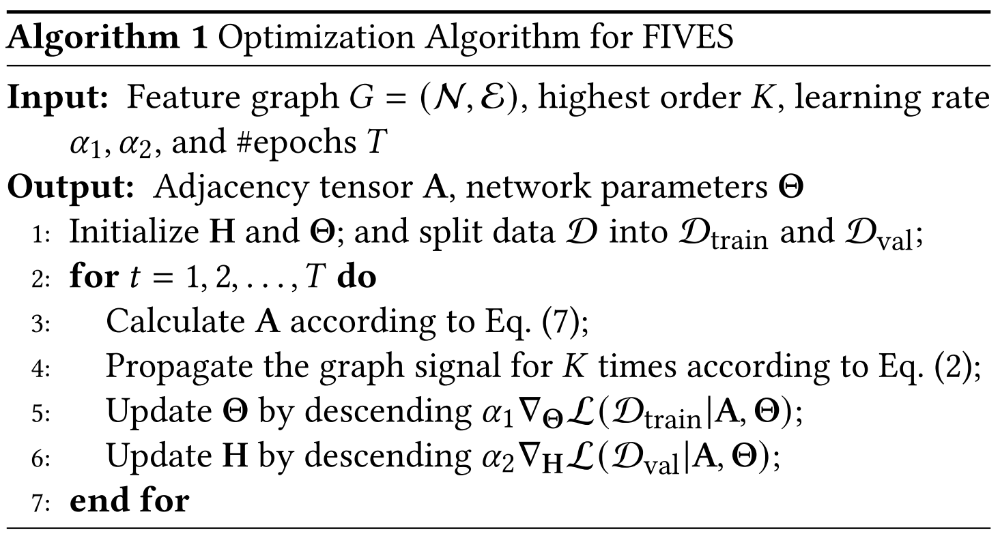
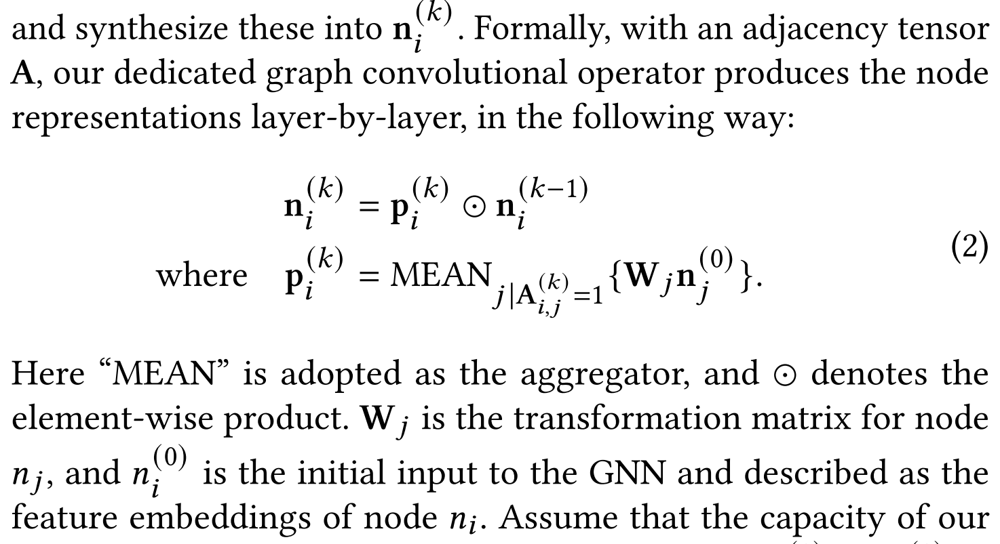
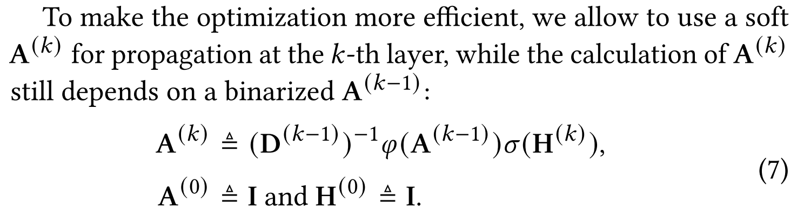
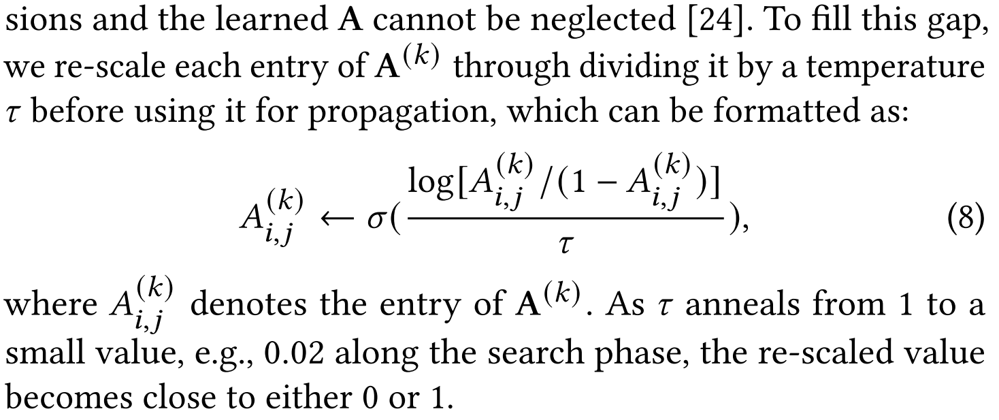

**Main idea** - Search for cross features through graph adjacency matrix learning  
**Preprocessing** - all numeric features are discretized by 10, 100, 1000 and OHE  
**Learning** - concat all node representations from last time + MLP + sigmoid + BCE  

### Results
- Need to specify threshhold for binarization (phi func)
- Temperature scaling deals with problem of ~0.5 prob before applying phi func
- 1e-4 wd + 0.3 dropout for preventing overfitting
- SOTA results + 1 week AB testing

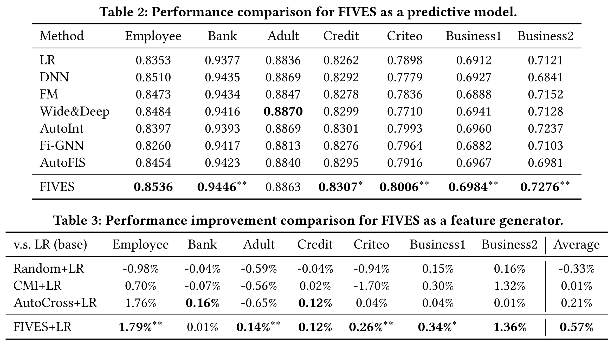  

### Comments
- only LR were tested on generated features 
